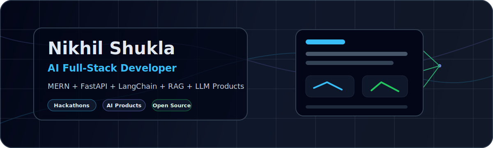

  

  

  
  
  
  

<table>
  <tr>
    <td width="58%">
      <h2>Hi, I'm Nikhil Shukla</h2>
      

        I build AI-integrated full-stack products with MERN, FastAPI, LangChain, RAG,
        OpenAI, HuggingFace, MongoDB, vector search, and deployment workflows.
      

      

        <b>Proof points:</b> 
        - 2nd Place Winner at AMUHACK National Level Hackathon 
        - Grand Finalist at MumbaiHacks 2025, selected from 27,000+ global applicants 
        - 5x National Hackathon Finalist 
        - Building AI placement, career, healthcare, civic-tech, and affiliate products
      

    </td>
    <td width="42%">
      
    </td>
  </tr>
</table>

## What I Build

<table>
  <tr>
    <td width="33%">
      <h3>AI Product Systems</h3>
      RAG pipelines, vector search, AI mentors, skill extraction, resume intelligence, and LLM workflows.
    </td>
    <td width="33%">
      <h3>Full-Stack Platforms</h3>
      React, Node.js, Express, MongoDB, Tailwind, REST APIs, auth, dashboards, and production deployments.
    </td>
    <td width="33%">
      <h3>Real-World Automation</h3>
      Placement tools, affiliate systems, report scanning, smart civic apps, and data-driven workflows.
    </td>
  </tr>
</table>

## Tech Stack

  

  
  
  
  
  

## Featured Work

<table>
  <tr>
    <td width="50%">
      
    </td>
    <td width="50%">
      
    </td>
  </tr>
  <tr>
    <td width="50%">
      
    </td>
    <td width="50%">
      
    </td>
  </tr>
</table>

## Build Highlights

| Project | What it proves | Stack |
| --- | --- | --- |
| SkillBridge | AI placement intelligence, RAG, fine-tuned guidance, video interview simulation | Node.js, React, MongoDB, OpenAI, Whisper, HuggingFace |
| Bridge-AI | Academic-to-career translation engine with skill extraction and role matching | Python, FastAPI, LangChain, React, MongoDB |
| TechTrendyDeals | Amazon affiliate product platform with SEO and monetization workflows | React, Node.js, Tailwind, APIs |
| CareKaro | Healthcare support platform with AI doctor bot and report scanning flow | React, JavaScript, AI workflows |

## GitHub Pulse

  
  

  

  

## Contribution Animation

  

## Let's Build

  <b>Open to AI product ideas, hackathon builds, open-source collaboration, internships, and full-stack AI projects.</b>

  

